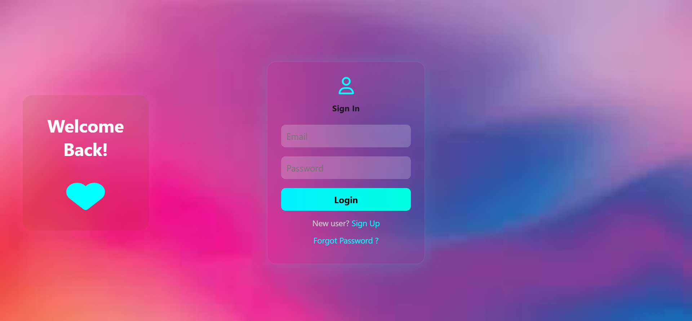

# Login-Form
# 🔐 Login Form with Create Account & Forgot Password

A responsive and interactive frontend login system built using **HTML**, **CSS**, and **JavaScript**. This project simulates a complete user authentication UI experience including login, account creation, and password reset interfaces.

## 🛠️ Tech Stack Used

This project is made using only frontend technologies. It’s perfect for beginners who want to learn how to build a responsive and interactive login system.

### 🔹 HTML (HyperText Markup Language)
- Creates the basic structure of the webpage.
- Contains forms for login, sign-up, and password reset.
- Includes input fields, buttons, and layout elements.

### 🔹 CSS (Cascading Style Sheets)
- Used for designing and styling the UI.
- Adds colors, fonts, spacing, and transitions.
- Ensures the layout is responsive for all screen sizes.

### 🔹 JavaScript
- Makes the form interactive and dynamic.
- Handles:
  - Switching between forms (login, sign up, forgot password)
  - Showing and hiding the password
  - Basic input validation and alert messages

> This project does not use any frameworks or libraries, making it easy to understand and fully beginner-friendly.

## 📸 Demo

---

## ✨ Features

- ✅ Modern login interface with form validation
- 🆕 Create Account page with input checks
- 🔁 Forgot Password form with prompt
- 👁 Show/Hide password toggle
- 📱 Fully responsive for mobile and tablet screens
- 🎨 Custom transitions and UI effects using CSS
- 🚫 Clear error messages for invalid input

---
